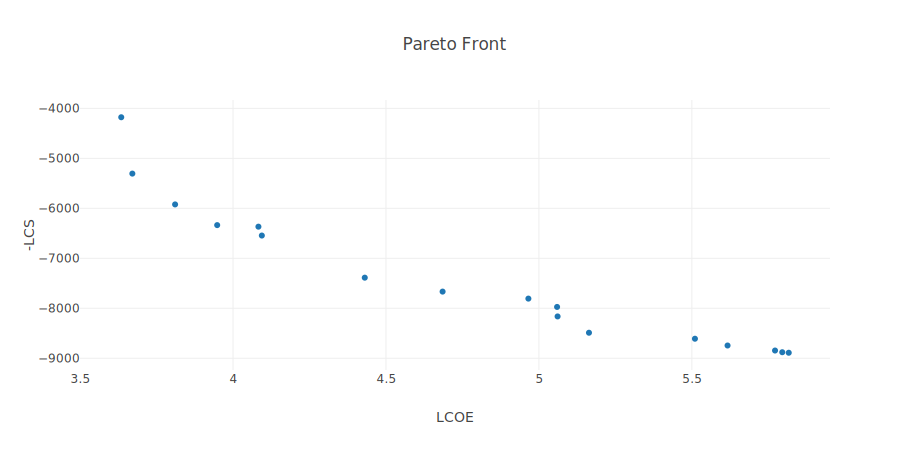

# sammoo

**SAMMOO: System Advisor Model Multi-Objective Optimization**

**Python-based Framework for Multi-Objective Optimization of Renewable Energy Systems using NREL's System Advisor Model (SAM)**

Optimization of Solar Industrial Process Heat (SIPH) systems using Concentrated Solar Power (CSP) technologies through the NREL [PySAM](https://nrel-pysam.readthedocs.io/en/latest/) package (System Advisor Model). This project was developed in the context of my Master's Thesis in Research in Industrial Technologies at the Universidad Nacional de Educación a Distancia (UNED), Spain.

<p align="center">
  
</p>


---

## 🌞 Overview

This Python package integrates:
- **System Advisor Model (SAM)** via NREL PySAM for the simulation of parabolic trough systems.
- **ParMOO** for multi-objective optimization using surrogate models.

It allows you to:
- Run parametric studies on industrial CSP systems.
- Optimize system configurations with multiple economic and technical objectives.
- Analyze Pareto fronts and export results.

<p align="center">
  
</p>

## 📦 Features

- Modular simulation wrapper (`ConfigSelection`) for different SAM configurations.
- Integration with PySAM modules: `TroughPhysicalIph`, `LcoefcrDesign`, `CashloanHeat`, etc.
- Multi-objective optimization engine (`ParMOOSim`) using ParMOO.
- Automatic switching from sequential to batch acquisition.
- Exportable plots and CSV reports.

## Thermal Load Profiles

### 🔥 ThermalLoadProfileLPG

The `ThermalLoadProfileLPG` class generates a realistic hourly **thermal load profile** from monthly LPG consumption (in tonnes), compatible with SAM’s “User-defined thermal load profile” input.

- Working schedule: Monday to Friday, 6:00–19:00
- Outputs hourly thermal demand in kJ/h, kWh, and kW
- Includes:
  - Yearly and weekly plotting
  - CSV export
  - Energy balance summary

#### Example usage:

```python
from sammoo.profiles.thermal_load_lpg import ThermalLoadProfileLPG

monthly_data = {1: 5000, 2: 4000, ..., 12: 3000}
profile = ThermalLoadProfileLPG(monthly_data)
profile.plot_year()
profile.export_csv("thermal_profile.csv")
```

## 🗂️ Project Structure

```
sammoo/
├── sammoo/                           # Core package
│ ├── __init__.py
│ ├── version.py
│ ├── config.py                       # Contains ConfigSelection class
│ ├── optimizer.py                    # Contains ParMOOSim class
│ ├── profiles/
│ │   ├── __init__.py
│ │   └── thermal_load_lpg.py         # ThermalLoadProfileLPG class
│ ├── resources/
│ │   └── solar_resource/
│ │       └── tucson.csv
│ └── templates/                      # JSON SAM templates
│   ├── __init__.py
│   └── iph_parabolic_commercial_owner/
│      ├── __init__.py
│      └── *.json
├── examples/                         # Example usage scripts
│ └── single_objective_comparison.py
├── README.md
├── CHANGELOG.md
├── pyproject.toml
├── MANIFEST.in
├── LICENSE
```

## 📂 Example Scripts

The `examples/` folder contains several usage scenarios of the `sammoo` package:

- `lpg_usage.py`: Generate and visualize an hourly thermal load profile from monthly LPG consumption.
- `multiobj_row_distance_opt.py`: Multi-objective optimization of solar field row spacing using ParMOO.
- `opt_layout.py`: Explore physical parameters and outputs of a CSP system using direct PySAM access.
- `parabolicIPHcommercial_owner.py`: Multi-objective optimization of design parameters (tshours, SM, T_loop_out).
- `single_objective_comparison.py`: Compare optimal designs for different single-objective formulations.
- `test_utility_module.py`: Investigate the output of the UtilityRate5 module and check consistency of billing results.

💡 **Note**: Example scripts (`examples/`) are not included in the PyPI installation.  
If you want to explore the examples, please [clone the GitHub repository](https://github.com/ppadillaq/sammoo).


---

## 🚀 Quick Start

### ✅ Option 1: Install from PyPI *(recommended for users)*

```bash
pip install sammoo
```

You can now use the package in Python:
```bash
from sammoo import ConfigSelection, ParMOOSim
```
> 💡 **Note:** Example scripts (`examples/`) are not included in the PyPI installation.  
> If you want to explore examples, clone the GitHub repository instead:

```bash
git clone https://github.com/ppadillaq/sammoo.git
cd sammoo
python examples/single_objective_comparison.py
```

### 🛠 Option 2: Install from source (for development)
If you want to work with the source code:
```bash
git clone https://github.com/ppadillaq/sammoo.git
cd sammoo
pip install -e .
```

### ▶️ Run an example

```bash
python examples/single_objective_comparison.py
```

## 🛠 Dependencies

- Python ≥ 3.8
- NREL PySAM
- ParMOO
- NumPy
- Matplotlib (for plotting)

Install them via:

```
pip install pysam parmoo numpy matplotlib
```

## 📈 Example Use Case

```python
from sammoo import ConfigSelection, ParMOOSim

design_vars = {
    "specified_solar_multiple": [(1.0, 3.0), "float"],
    "tshours": [(2, 8), "int"]
}

selected_outputs = ["LCOE", "-NPV"]

cfg = ConfigSelection(
    config="Commercial owner",
    selected_outputs=selected_outputs,
    design_variables=design_vars
)

opt = ParMOOSim(cfg, auto_switch=True)
opt.optimize_step()
opt.plot_results()
```

## ☀️ Weather Data

The simulation requires a weather file (`file_name`) in CSV format. You can:

- ✅ Provide your own via `user_weather_file="path/to/weather.csv"`
- 🔁 Or let the framework use a built-in default (Tucson, AZ)

Your custom weather files must follow the TMY3 format used by SAM.


## 📚 Publications

The version **1.0.0** of this project was submitted as part of the following Master's Thesis:

- Pedro Padilla Quesada. *Optimization of Solar Industrial Process Heat (SIPH) Systems with Parabolic Troughs using PySAM and Multi-objective Optimization*. Master’s Thesis in Research in Industrial Technologies, Universidad Nacional de Educación a Distancia (UNED), Spain, 2025.

[Download full thesis (PDF)](link_to_pdf_if_any)

Future versions may include broader support for other CSP technologies, reinforcement learning-based controllers, and integration with digital twin platforms.


## 📄 License

This project is licensed under the **BSD 3-Clause License**.  
See the [`LICENSE`](./LICENSE) file for full text.

## 👤 Author

Pedro Padilla Quesada
MSc in Research in Industrial Technologies
UNED, Spain

