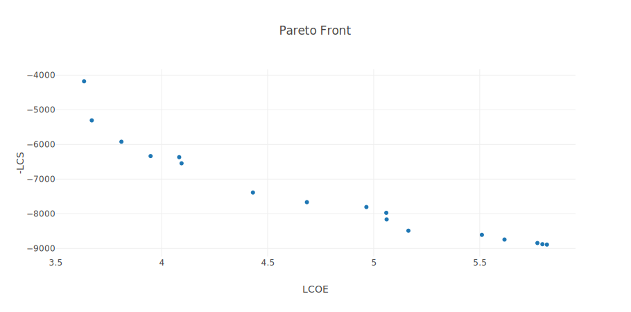

# sammoo

**SAMMOO: System Advisor Model Multi-Objective Optimization**

**Python-based Framework for Multi-Objective Optimization of Renewable Energy Systems using NREL's System Advisor Model (SAM)**

Optimization of Solar Industrial Process Heat (SIPH) systems using Concentrated Solar Power (CSP) technologies through the NREL [PySAM](https://nrel-pysam.readthedocs.io/en/latest/) package (System Advisor Model). This project was developed in the context of my Master's Thesis in Research in Industrial Technologies at the Universidad Nacional de Educación a Distancia (UNED), Spain.

<p align="center">
  
</p>


---

## 🌞 Overview

This Python package integrates:
- **System Advisor Model (SAM)** via NREL PySAM for the simulation of parabolic trough systems.
- **ParMOO** for multi-objective optimization using surrogate models.

It allows you to:
- Run parametric studies on industrial CSP systems.
- Optimize system configurations with multiple economic and technical objectives.
- Analyze Pareto fronts and export results.

<p align="center">
  
</p>

## 📦 Features

- Modular simulation wrapper (`ConfigSelection`) for different SAM configurations.
- Integration with PySAM modules: `TroughPhysicalIph`, `LcoefcrDesign`, `CashloanHeat`, etc.
- Multi-objective optimization engine (`ParMOOSim`) using ParMOO.
- Automatic switching from sequential to batch acquisition.
- Exportable plots and CSV reports.

## Thermal Load Profiles

### 🔥 ThermalLoadProfileLPG

The `ThermalLoadProfileLPG` class generates a realistic hourly **thermal load profile** from monthly LPG consumption (in tonnes), compatible with SAM’s “User-defined thermal load profile” input.

- Working schedule: Monday to Friday, 6:00–19:00
- Outputs hourly thermal demand in kJ/h, kWh, and kW
- Includes:
  - Yearly and weekly plotting
  - CSV export
  - Energy balance summary

#### Example usage:

```python
from sammoo.profiles.thermal_load_lpg import ThermalLoadProfileLPG

monthly_data = {1: 5000, 2: 4000, ..., 12: 3000}
profile = ThermalLoadProfileLPG(monthly_data)
profile.plot_year()
profile.export_csv("thermal_profile.csv")
```

## 🗂️ Project Structure

```
sammoo/
├── sammoo/                             # Core package
│   ├── __init__.py
│   ├── version.py
│   ├── config_selection.py              # ConfigSelection class
│   ├── parmoo_simulation.py             # ParMOOSim class
│   ├── components/                      # New components module (v0.2.0)
│   │   ├── __init__.py
│   │   ├── thermal_load_lpg.py          # ThermalLoadProfileLPG class (enhanced)
│   │   ├── weather_design_point.py      # Weather-based DNI calculation helper
│   │   └── solar_loop_configuration.py  # Solar field / loop setup helpers
│   ├── resources/
│   │   ├── solar_resource/
│   │   │   └── seville_spain.csv        # Default weather CSV
│   │   └── collector_data/
│   │       └── iph_collectors_parameters.csv  # Industrial Process Heat collectors database
│   └── templates/                       # JSON SAM templates
│       ├── __init__.py
│       └── iph_parabolic_commercial_owner/
│           ├── __init__.py
│           └── *.json
├── examples/                            # Example usage scripts
│   ├── op1_single_objective_comparison.py
│   ├── opt2_design_point_multiobj.py
│   ├── opt3_multiobj_row_distance.py
│   └── opt4_startup_shutdown.py
├── README.md
├── CHANGELOG.md
├── pyproject.toml
├── MANIFEST.in
├── LICENSE

```

## 📂 Example Scripts

The `examples/` folder contains several usage scenarios of the `sammoo` package:

- `opt1_single_objective_comparison.py`: Compare optimal designs for different single-objective formulations (e.g., LCOE, Payback, LCS, NPV).
- `opt2_design_point_multiobj.py`: Multi-objective optimization at a fixed design point (e.g., SM and storage hours), optionally applying a thermal load profile.
- `opt3_multiobj_row_distance.py`: Multi-objective optimization of solar field row spacing (`Row_Distance`) using ParMOO.
- `opt4_startup_shutdown.py`: Optimization focusing on startup/shutdown temperatures and their impact on techno-economic performance.

💡 **Note**: Example scripts (`examples/`) are not included in the PyPI installation.  
If you want to explore the examples, please [clone the GitHub repository](https://github.com/ppadillaq/sammoo).


---

## 🚀 Quick Start

### ✅ Option 1: Install from PyPI *(recommended for users)*

```bash
pip install sammoo
```

You can now use the package in Python:
```bash
from sammoo import ConfigSelection, ParMOOSim
```
> 💡 **Note:** Example scripts (`examples/`) are not included in the PyPI installation.  
> If you want to explore examples, clone the GitHub repository instead:

```bash
git clone https://github.com/ppadillaq/sammoo.git
cd sammoo
python examples/single_objective_comparison.py
```

### 🛠 Option 2: Install from source (for development)
If you want to work with the source code:
```bash
git clone https://github.com/ppadillaq/sammoo.git
cd sammoo
pip install -e .
```

### ▶️ Run an example

```bash
python examples/opt1_single_objective_comparison.py
```

## 🛠 Dependencies

- Python ≥ 3.10
- NREL PySAM
- ParMOO
- NumPy
- Matplotlib (for plotting)

Install them via:

```
pip install pysam parmoo numpy matplotlib
```

## 📈 Example Use Case

```python
# Minimal example: multi-objective optimization with a thermal load profile

from sammoo import ConfigSelection, ParMOOSim
from sammoo.components import ThermalLoadProfileLPG

# 1) (Optional) Generate an hourly thermal load profile from monthly LPG consumption (kg)
monthly_kg = {1: 11000, 2: 9000, 3: 8000, 4: 9500, 5: 9200, 6: 9800,
              7: 8600, 8: 8700, 9: 9000, 10: 9400, 11: 8800, 12: 9600}
profile = ThermalLoadProfileLPG(monthly_kg=monthly_kg)  # uses default efficiency and PCI

# 2) Define the design space (use "continuous" / "integer")
design_vars = {
    "specified_solar_multiple": ([1.0, 3.0], "continuous"),
    "tshours": ([2, 8], "integer"),
}

# 3) Define objectives (minimize LCOE, maximize LCS)
selected_outputs = ["LCOE", "-LCS"]

# 4) Create the SAM configuration (optionally set collector/HTF)
cfg = ConfigSelection(
    config="Commercial owner",
    selected_outputs=selected_outputs,
    design_variables=design_vars,
    collector_name="Power Trough 250",   # optional
    htf_name="Therminol VP-1",           # optional
    verbose=0
)

# Apply the demand profile → sets timestep_load_abs and sizes q_pb_design
profile.apply_to_config(cfg)

# 5) Run the optimization (increase search_budget and sim_max for better results)
opt = ParMOOSim(cfg, search_budget=20, auto_switch=True)
opt.solve_all(sim_max=50)

# 6) Display results
print(opt.get_results())

```

## ☀️ Weather Data

The simulation requires a weather file (`file_name`) in CSV format. You can:

- ✅ Provide your own via `user_weather_file="path/to/weather.csv"`
- 🔁 Or let the framework use a built-in default (Tucson, AZ)

Your custom weather files must follow the TMY3 format used by SAM.


## 📚 Publications

Version **0.3.0** of this project was used in the development of the following master's thesis in the Master's programme in *Research in Industrial Technologies* (Energy Engineering track), UNED (Spain):

- Padilla-Quesada, P. (2025). *Sammoo: Un marco de optimización multiobjetivo basada en simulaciones para el diseño de sistemas solares térmicos de calor de proceso industrial* [Trabajo Fin de Máster, Universidad Nacional de Educación a Distancia (UNED)]. https://hdl.handle.net/20.500.14468/31636

[Download full thesis (PDF)](https://e-spacio.uned.es/bitstreams/87c9541c-8e90-4a36-a15d-b0c7b5e2132f/download)

Future versions may include broader support for other CSP technologies, reinforcement learning-based controllers, and integration with digital twin platforms.


## 📄 License

This project is licensed under the **BSD 3-Clause License**.  
See the [`LICENSE`](./LICENSE) file for full text.

## 👤 Author

Pedro Padilla Quesada<br>
MSc in Research in Industrial Technologies<br>
UNED, Spain

